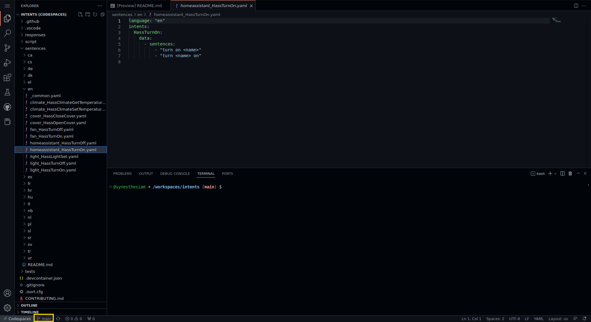
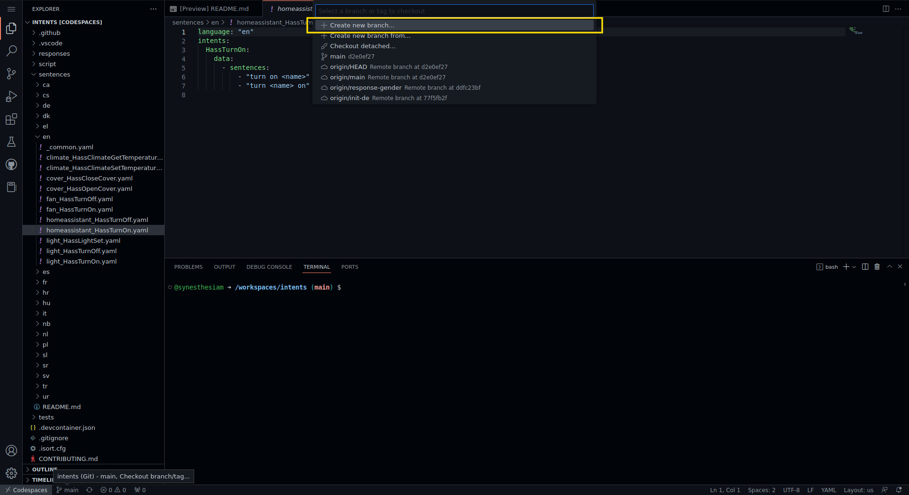
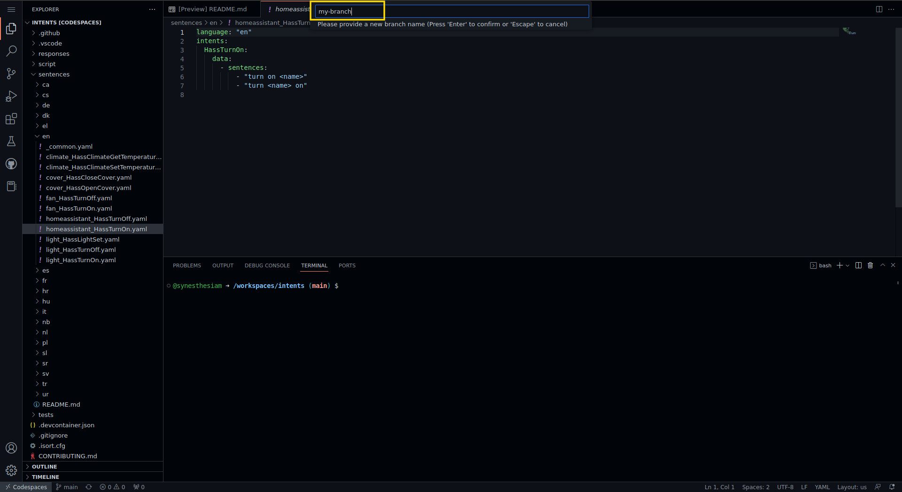
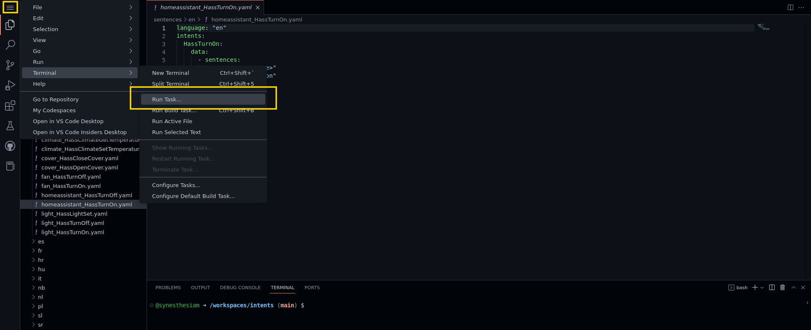
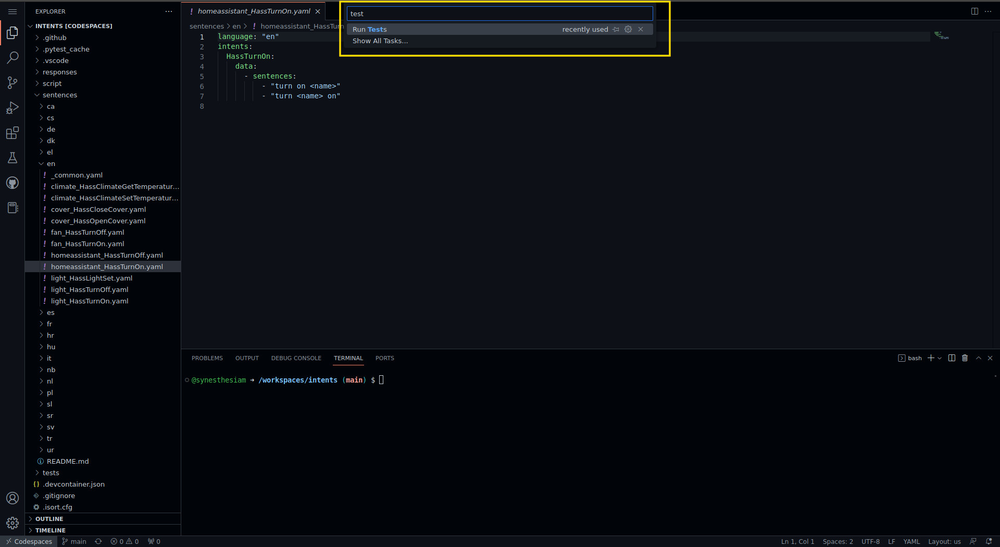
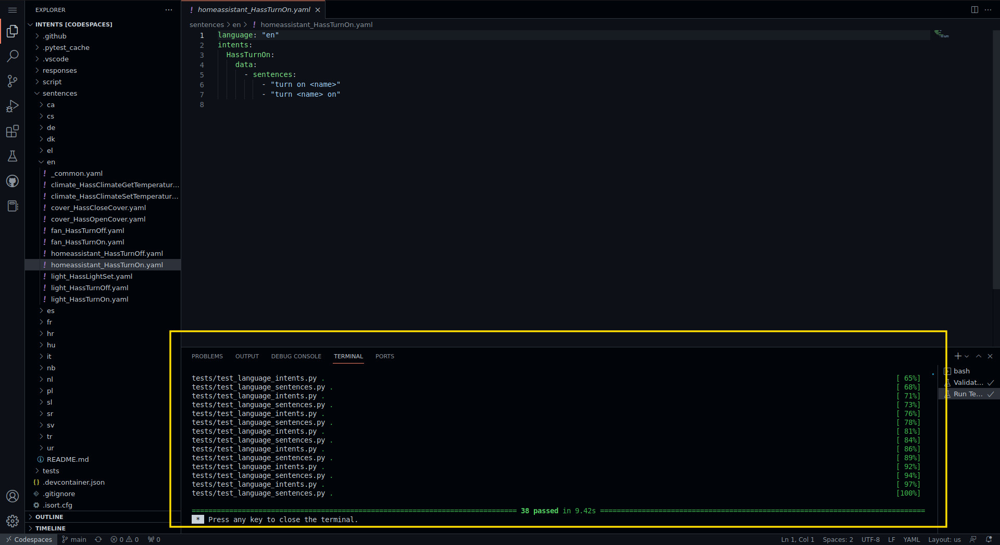
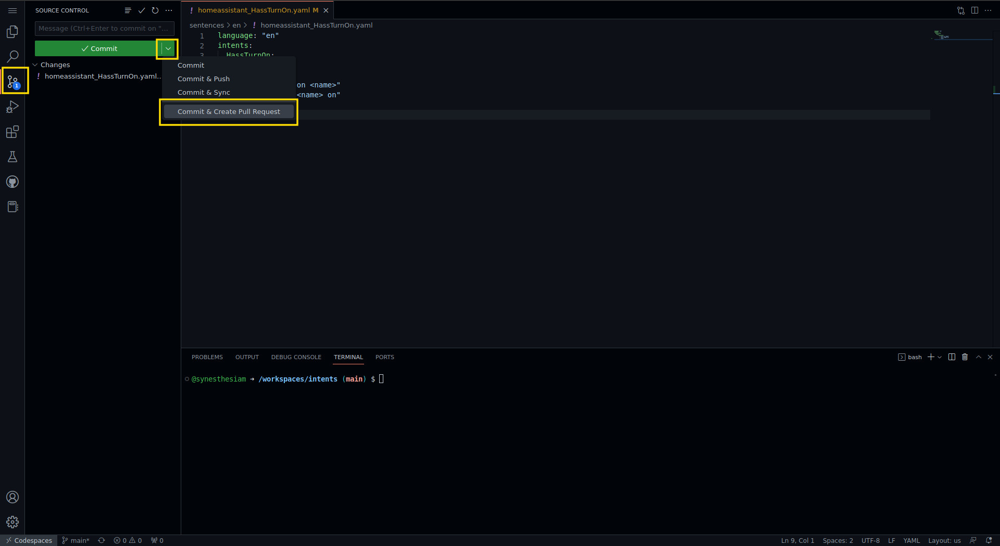
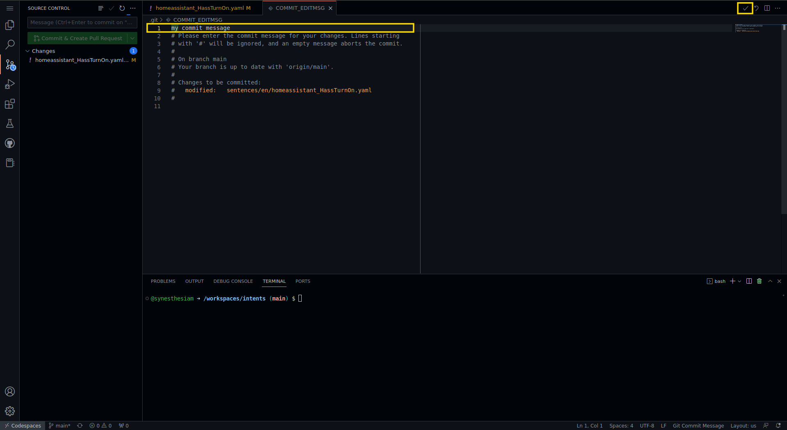
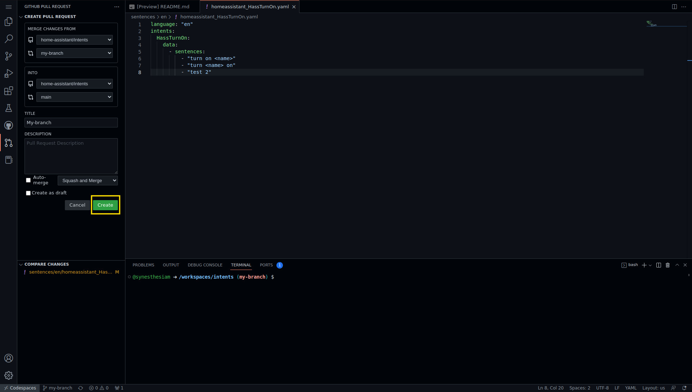

# Codespaces Workflow

A complete development environment can be accessed through [GitHub Codespaces](https://docs.github.com/codespaces/overview).

To get started, click the green "Code" button on the repository's main page, and then click "Create codespace on main":

After a minute or two, your codespace will be ready with a VSCode editor:

Before making changes, click on the "main" branch name at the bottom of the window:

Click "Create new branch" at the top of the window:

Enter a name for your branch and then press Enter:

Once you've made some changes, you can run the tests right here! Choose "Terminal" and then "Run Task" from the hamburger menu (3 lines) on the left sidebar:

Next, type "test" into the text box at the top and click "Run tests for current file":

In the terminal window below, you can see if the tests were successful:

When you've finished your changes, click the source control button on the left sidebar and then "Commit & Create Pull Request":

Enter a commit message and click the checkmark button to complete:

Finally, enter a title and description for your pull request in the left sidebar. Click the "Create" button to submit:

