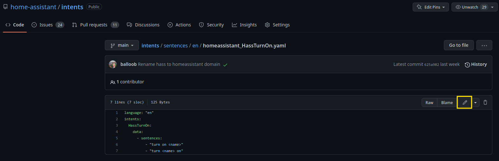
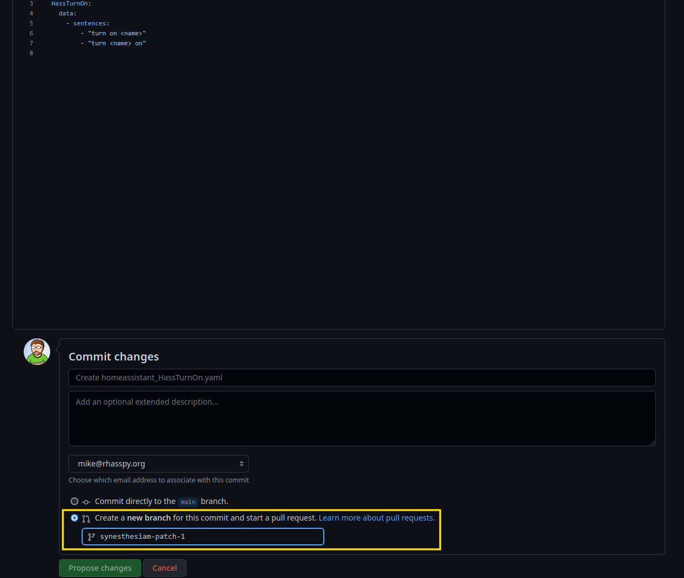

# Github Workflow

For small edits to existing files, you can use the editing functionality built directly into Github.

First, navigate to the YAML file you want to edit and click the pencil icon in the upper-right corner:

Next, make your changes to the file. When you're finished, scroll down and choose the "Create a new branch for this commit and start a pull request" option:

After entering a description of your changes and clicking the "Propose changes" button, your changes should be available in the repository's "Pull Requests" section.
