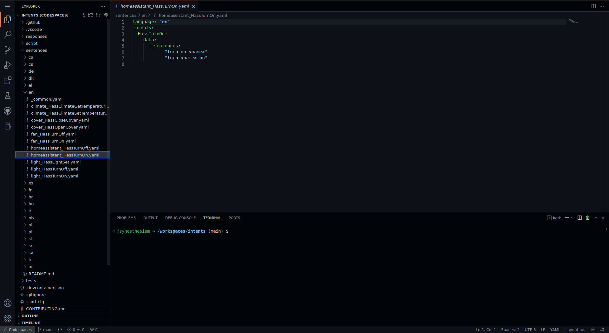

# Sentence Templates

This repository uses a special template syntax for describing sentences called the [Home Assistant Intent Language](https://github.com/home-assistant/hassil) or HassIL.
The HassIL syntax lets you **compactly describe a set of sentences**, for either matching or generating text.

* [Alternatives](#alternatives)
* [Optionals](#optionals)
* [Lists and Slots](#lists-and-slots)
* [Expansion Rules](#expansion-rules)


## Getting Started

To follow along with this guide, you will need to set up a development environment. The easiest way is to create a codespace on Github:


This will set up a complete environment for you, and provide a code editor and terminal:



If you prefer a local environment, you will need to clone the repository:

```sh
git clone https://github.com/home-assistant/intents
```

and then run the setup script:

```sh
cd intents
script/setup
```


## Sampling Sentences

Once you have a development environment set up, ensure you can run the following command in a terminal:

```sh
python3 -m script.intentfest sample_template 'this is a test'
```

If successful, it will print "this is a test".

We will use the `sample_template` tool to demonstrate the different elements of the template syntax.


## Alternatives

When your sentence has spots where multiple words or phrases are possible, group them with parentheses `( )` and use the `|` character to separate the alternatives:


```sh
python3 -m script.intentfest sample_template 'set color to (red | green | blue)'
```

This will print 3 possible sentences:

```
set color to red
set color to green
set color to blue
```

Alternatives can also be used as part of a word:

```sh
python3 -m script.intentfest sample_template 'turn(s | ed | ing)'
```

which prints:

```
turns
turned
turning
```


## Optionals

If a word, phrase, or part of a word may be omitted, use square brackets `[ ]` around it:

```sh
python3 -m script.intentfest sample_template 'turn on [the] light[s]'
```

Since each optional part may or may not be there, this will print 4 possible sentences:

```
turn on the lights
turn on the light
turn on lights
turn on light
```


## Lists

When different sentence templates share collections of possible values (or ranges of numbers), a `{list}` is needed:

```sh
python3 -m script.intentfest sample_template 'set color to {color}' --values color red green blue 
```

which prints the same thing as the earlier example:

```
set color to red
set color to green
set color to blue
```

In the [YAML format for sentences](../sentences/README.md#file-format), this would be written as:

```yaml
lists:
  color:
    values:
      - "red"
      - "green"
      - "blue"
```

Number ranges can also come from a `{list}`:

```sh
python3 -m script.intentfest sample_template 'run test {num}' --range num 1 3
```

Each number from 1 to 3 (inclusive) will produce a different sentence:

```
run test 1
run test 2
run test 3
```

In YAML, this range would be written as:

```yaml
lists:
  num:
    range:
      start: 1
      stop: 3
```

### Lists and Slots

Lists serve a second purpose when matching text to an intent: any text that is part of a list will be put into an intent **slot of the same name.**

For example, consider the `HassTurnOn` intent, which contains a `name` slot with the name of the device or entity to turn on.
When the text "turn on my light" is being matched to `HassTurnOn`, we would like "my light" to end up in `name`. This is done by:

1. Creating a list called "name" with the possible light names (e.g., "my light")
2. Using `{name}` in a sentence template for `HassTurnOn` 

In YAML, we can put this all together:

```yaml
language: "en"
intents:
  HassTurnOn:
    data:
      - sentences:
          - "turn on {name}"
lists:
  name:
    values:
      - "my light"
```

This will match the sentence "turn on my light" to the `HassTurnOn` intent *and* put "my light" into its `name` slot.

*Hint*: if your slot is named differently than your list, use `{list_name:slot_name}`


### Expansion Rules

Commonly used sentence template snippets can be replaced with a `<rule>`. These rules are automatically expanded inside templates, and can reference both lists and other rules.

In [YAML](../sentences/README.md#file-format), this looks like:

```yaml
language: "en"
intents:
  HassLightSet:
    data:
      - sentences:
          - "set light to <color>"
expansion_rules:
  color: "(red | green | blue)"
```

On the command line, we can use them with `--rule`:

```sh
python3 -m script.intentfest sample_template 'set color to <color>' --rule color '(red | green | blue)' 
```

which again prints:

```
set color to red
set color to green
set color to blue
```

Expansion rules are especially useful when combined with lists:

```yaml
language: "en"
intents:
  HassLightSet:
    data:
      - sentences:
          - "set light to <color>"
lists:
  color:
    values:
      - "red"
      - "green"
      - "blue"
expansion_rules:
  color: "[the color] {color}"
```

*Note*: the list and rule names do not both have to be "color".

On the command line, we now have:

```sh
python3 -m script.intentfest sample_template 'set color to <color>' --rule color '[the color] {color}' --values color red green blue 
```

which prints all 6 possible sentences:

```
set color to the color red
set color to the color green
set color to the color blue
set color to red
set color to green
set color to blue
```
